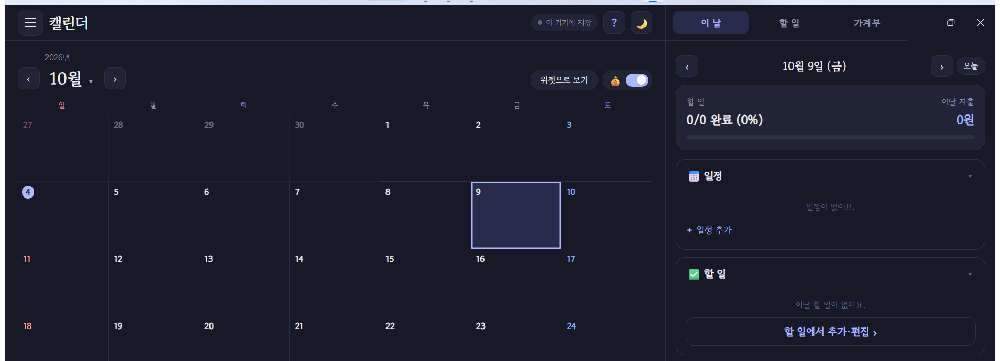
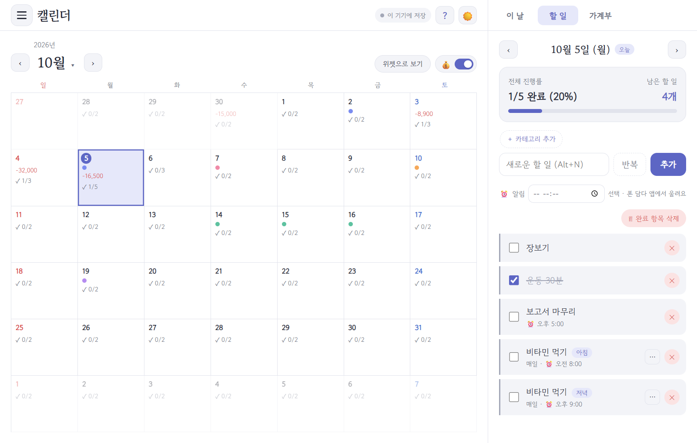
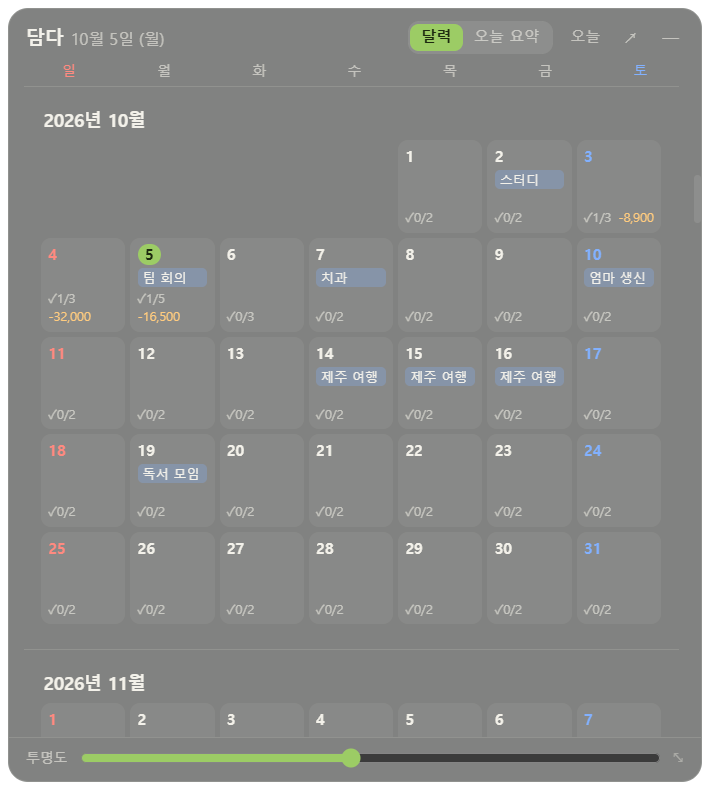
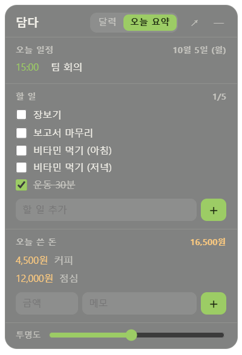
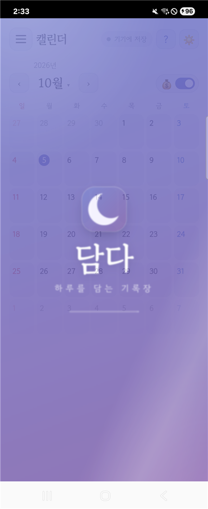
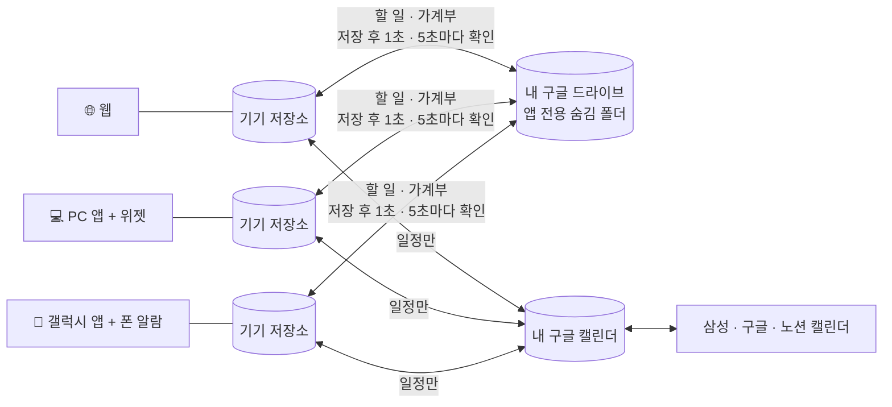

<div align="center">


# 담다 · Damda

### 하루를 담는 기록장

**캘린더 · 할 일 · 가계부를 한곳에.**<br/>
웹 · PC · 갤럭시 어디서 적어도 똑같이 맞춰지고, 기록은 내 기기와 내 구글 계정에만 남습니다.




</div>

---

## 📥 설치하기

| | 🌐 웹 | 💻 PC (Windows) | 📱 갤럭시 (Android) |
|---|---|---|---|
| **받기** | **[바로 열기 →](https://crowtit517.github.io/damdanote/)** | **[Damda-Setup.exe 받기](https://github.com/Crowtit517/damdanote/releases/latest/download/Damda-Setup.exe)** | **[Damda-Galaxy.apk 받기](https://github.com/Crowtit517/damdanote/releases/latest/download/Damda-Galaxy.apk)** |
| **설치** | 크롬 주소창의 **설치** 아이콘<br/>(폰은 ⋮ → 홈 화면에 추가) | 받은 파일 실행 → 끝<br/>바탕화면에 **"담다"** | 받은 파일 열기 → 설치 |
| **처음 한 번** | — | "Windows의 PC 보호" → **추가 정보 → 실행** | "출처를 알 수 없는 앱" → **허용** |
| **특별한 점** | 설치 없이 어디서나 | 창 전체 화면 · **바탕화면 위젯** | **폰 알람으로 알림** (앱을 꺼도 울림) |
| **로그인** | 약 1시간마다 자동 갱신 | 기본 브라우저에서 한 번 → **계속 유지** | 폰의 구글 계정 고르기 → **계속 유지** |

> 설치 후 ☰ 메뉴 → **[구글 계정으로 연결]** 을 누르면 세 곳의 기록이 자동으로 맞춰집니다.
> 처음 연결할 때 구글이 **"확인되지 않은 앱"** 화면을 보여 줍니다(개인 앱이라 구글 심사를 받지 않았기 때문). **[고급] → [담다(으)로 이동]** 을 누르면 됩니다. 담다는 서버가 없고 기록을 어디에도 보내지 않습니다 → [개인정보처리방침](https://crowtit517.github.io/damdanote/privacy.html)
> 로그인 없이도 그 기기 안에서는 모두 쓸 수 있습니다.

---

## 👀 한눈에 보기

| 💻 PC: 할 일 탭 | 🖼 바탕화면 위젯 (달력) | 🖼 위젯 (오늘 요약) |
|:---:|:---:|:---:|
|  |  |  |

| 📱 갤럭시 시작 화면 | 📱 할 일 | 📱 가계부 | 📱 금액 숨기기 |
|:---:|:---:|:---:|:---:|
|  |  |  |  |

---

## ✨ 이런 걸 할 수 있어요

### 📅 캘린더 — 날짜 하나에 하루 전부
- 날짜를 누르면 그날의 **일정 · 할 일 · 쓴 돈**이 한 번에 나옵니다.
- **구글 캘린더와 자동으로 주고받기**: 삼성·구글·노션 캘린더의 일정이 담다에 보이고, 담다에서 고친 일정은 폰 캘린더에도 반영됩니다. **일정만** 주고받아서 할 일과 돈 정보는 캘린더로 새지 않습니다.
- 개인 · 회사 · 학교처럼 **여러 구글 계정**을 함께 볼 수 있습니다.
- **💰 금액 숨기기 스위치**: 옆에 사람이 있을 때 한 번 누르면 달력, 패널, 위젯의 금액이 모두 숨겨집니다.

### ✅ 할 일 — 꾸준함까지
- 카테고리별 진행률, 밀린 할 일 한 번에 가져오기.
- **반복 할 일**: 매일 · 요일 · 매월, 하루 1~3번(아침·점심·저녁), 🔥 연속 기록.
- **⏰ 알림 시간**: "아침 9시 약 먹기"처럼 시간을 정하면 **갤럭시 앱이 폰 알람으로** 알려 줍니다. 앱을 꺼도, 인터넷이 없어도 울립니다.

### 💰 가계부 — 금액 · 날짜 · 메모만
- 월·연 통계, **지난 기간 같은 시점과 비교하는** 누적 그래프, 카테고리별 지출.
- **고정 수입·지출**(월급·월세·통신비)은 한 번 등록하면 그날 자동으로 기록되고, 월말 예상 잔액도 계산합니다.
- 은행·카드 연동은 **일부러 넣지 않았습니다.** 직접 적는 대신 안전합니다.

### 💻 PC 앱 — 창 전체가 곧 앱
- 캘린더는 늘 왼쪽, 오른쪽은 **[이 날 · 할 일 · 가계부] 탭**. 경계를 끌면 오른쪽이 창의 1/3까지 넓어집니다.
- **바탕화면 위젯**: 다른 창 뒤, 바탕화면에 깔리는 반투명 달력. 날짜를 눌러 바로 체크·추가하고, **[오늘 요약]**으로 하루만 볼 수 있습니다. `Ctrl+Shift+D`로 꺼내기·숨기기.
- 창을 닫으면 **쓰던 글자까지 저장**하고 끝납니다. 다음에 열면 그대로 채워져 있습니다.

### 📱 갤럭시 앱 — 폰답게
- 폰의 구글 계정을 고르면 연결 끝. **로그인이 계속 유지**됩니다.
- 알림: 할 일 · 반복 할 일 · 담다 일정. 구글 캘린더 일정은 폰 캘린더 앱이 이미 알려 주니 **두 번 울리지 않게** 했습니다.
- 켤 때 "담다 · 하루를 담는 기록장" 시작 화면, 상태 표시줄도 담다 화면 색을 따라갑니다.

### 🧸 누구나 쓰기 쉽게
- **그림 사용 가이드**(? 버튼): 화면 그림 위의 반짝이는 곳과 👆로 설명. 초등학생도 따라 할 수 있게.
- 카테고리는 홈 화면처럼 꾹 눌러 정리하고, 끌어서 옮기고, 겹쳐서 묶습니다. 지워도 8초 안에 되돌리기.
- 밝은 화면 / 어두운 화면, 모든 창은 ✕ · 바깥 누르기 · Esc · 뒤로가기로 닫힙니다.

---

## 🔐 내 기록은 어디에?



| 원칙 | 구체적으로 |
|---|---|
| **운영 서버 없음** | 기록은 내 기기와 **내** 구글 드라이브(앱 전용 숨김 폴더) · **내** 구글 캘린더에만. 운영자가 보관하는 데이터가 없습니다 |
| **기기 먼저** | 모든 기록은 먼저 기기에 저장 → 인터넷이 없어도 동작하고, 연결되면 맞춰집니다 |
| **최소 권한** | 드라이브는 담다 전용 폴더만(다른 파일은 볼 수 없음), 캘린더는 일정 보기·고치기만 |
| **금융 연동 금지** | 은행 · 카드 · 결제 연동 코드는 어떤 형태로도 넣지 않습니다 |
| **지워도 되돌릴 수 있게** | 실제로 지우지 않고 "지움" 표시 → 되돌리기와 기기 간 병합이 안전 |

---

## 🛠 만든 과정: 묻고, 정하고, 고쳤다

담다는 **기획자(사용자)가 묻고 결정하고, AI가 설명하고 구현하는** 방식으로 만들었습니다. 모든 요청과 결정은 [PLAN.md](PLAN.md)에 남겼습니다.

```
 ① 질문·아이디어 → ② 선택지와 장단점 설명 → ③ 사용자가 결정
        ↑                                          ↓
 ⑥ 피드백 ← ⑤ 실제 화면·실제 폰으로 확인 ← ④ 문서 기록 → 구현
```

| 숫자로 보는 담다 | |
|---|---|
| 요구사항 · 결정 기록 | **73개** · **64건** (번호·상태·요청일·변경 이력 관리) |
| 코드 | 웹 JS 모듈 37개 · 약 5,900줄 / PC 앱 약 850줄 / 갤럭시 앱(Java) 약 130줄 |
| 외부 라이브러리 (웹) | **0개** — 순수 HTML · CSS · JS, 차트도 직접 그린 SVG |
| 검증 | 가짜 구글 서버로 동기화·캘린더·로그인 시험, PC 전체 점검 68개, 실제 갤럭시(Z Flip3)에서 설치·알림·로그인 확인 |

### 대표적인 "물어보고 바꾼" 순간들

| 처음 | 사용자 피드백 (요약) | 바뀐 결과 |
|---|---|---|
| 글로 된 사용 가이드 | *초등학생 이하도 알아먹게* | **그림 카드 가이드** (반짝이는 곳 + 👆 + 한 줄) |
| 달력에 늘 보이는 금액 | *돈 문제니까 민감할 수 있잖아* | **💰 금액 숨기기 스위치** |
| 은행·카드 연동 아이디어 | *보안상 위험하니 선호하지 않아* | **금융 연동 금지**를 원칙으로 고정 |
| 구글 캘린더 읽기만 | *연동하면 자동으로 서로 다 수정 가능하게* | **자동 양방향 동기화** (일정만) |
| 동기화 방식 4개, 긴 계정 목록 | *메뉴가 많아서 더러워 보여* | 항상 자동 + 절약 모드, "담는 곳" 설정으로 정리 |
| 웹을 감싼 PC 창 | *창 전체가 곧 앱이었으면* | 꽉 찬 화면 + 오른쪽 [이 날 · 할 일 · 가계부] 탭 |
| 위젯 자리 버튼 3개 | *이것들 굳이 필요할까?* | 늘 바탕화면에 고정, 버튼 없앰 |
| PC 오른쪽 구역 넓이 | *왼쪽이 2/3 남고 오른쪽은 최대 1/3* | 끌어서 넓히되 1/3에서 멈춤 |
| 앱 안 구글 로그인 (구글이 막음) | *빠른 수정과 정확성을 기대할게* | **기본 브라우저 로그인 + 로그인 계속 유지** |
| 일정 알림을 담다도 보내기 | (제안 검토) | 구글 캘린더 일정은 캘린더 앱에 맡겨 **두 번 울리지 않게** |

---

## 🗺 로드맵

| 단계 | 내용 | 상태 |
|---|---|---|
| Phase 1 | 캘린더 · 할 일 · 가계부 · 카테고리 · 반복 · PWA | ✅ |
| Phase 2 | 웹 주소 공개 (GitHub Pages) | ✅ |
| Phase 3 | 구글 드라이브 동기화 + 기기 저장소(IndexedDB) | ✅ |
| Phase 4 | 구글 캘린더 자동 양방향 동기화 + 여러 계정 | ✅ |
| PC 앱 | Windows 앱 + 바탕화면 위젯 + 브라우저 로그인 | ✅ |
| Phase 5 | 갤럭시 앱 + 폰 알람 알림 | ✅ |
| Phase 6 | 다듬기 (검색 · 일정 막대 · 예산 등) | ⬜ |

보류·하지 않을 일은 [docs/backlog.md](docs/backlog.md)에 있습니다.

---

## 👩‍💻 직접 만들어 보기 (개발자용)

<details>
<summary>폴더 구조와 실행 방법 펼치기</summary>

```
damdanote/
├─ index.html · sw.js · manifest.webmanifest   웹 앱 (오프라인 실행·설치)
├─ css/style.css                               밝은/어두운 색, 전체 스타일 (PC·폰 전용 규칙 포함)
├─ js/
│  ├─ app.js            시작점: 화면 전환, ☰ 메뉴, 테마, 동기화 표시
│  ├─ store.js · db.js  기기 저장소 (IndexedDB, 병합·되돌리기)
│  ├─ desk.js · native.js  PC 앱 · 갤럭시 앱에서 열렸을 때만 그 기능 켜기
│  ├─ reminders.js      알림 예약 (폰 알람 · PC 소리 없는 알림)
│  ├─ sync/             구글 로그인 · 드라이브 · 동기화 엔진 · 구글 캘린더
│  ├─ views/ · parts/ · ui/   화면, 부품, 창 관리
├─ desktop/   PC 앱 (Electron): 창 · 위젯 · 시작 화면 · 브라우저 로그인
├─ mobile/    갤럭시 앱 (Capacitor): 폰 구글 로그인 · 폰 알람 알림
└─ docs/      설계 문서와 스크린샷
```

| 무엇을 | 어떻게 |
|---|---|
| 웹 | `python -m http.server 5500` → http://localhost:5500 (빌드 과정 없음) |
| PC 앱 | `cd desktop` → `npm install` → `npm run dev` (개발) / `npm run build` → `dist/Damda-Setup.exe`. 구글 로그인에는 `desktop/oauth.local.json`(데스크톱 앱 클라이언트) 필요 |
| 갤럭시 앱 | `cd mobile` → `npm install` → `npx cap sync android` → `cd android` → `gradlew assembleDebug`(시험용) · `mobile/release.cmd`(정식 서명 APK). 구글 콘솔에 Android 클라이언트(패키지 + 서명 SHA-1) 등록 |
| 내 구글 프로젝트로 | `js/config.js`의 클라이언트 ID를 바꾸고 [docs/data-sync.md](docs/data-sync.md) 8장대로 설정 |

| 문서 | 내용 |
|---|---|
| [PLAN.md](PLAN.md) | 계획 · 원칙 · 로드맵 · **요구사항 목록** · **결정 기록** |
| [docs/ui.md](docs/ui.md) | 화면 설계 (PC · 폰 포함) |
| [docs/data-sync.md](docs/data-sync.md) | 데이터 · 동기화 · 로그인 · 알림 · 보안 |
| [docs/other.md](docs/other.md) | 배포 · 설치 파일 · APK · 수익화 · 법 |
| [docs/backlog.md](docs/backlog.md) | 보류 · 하지 않을 일 |

</details>

---

<div align="center">

**기획 · 결정 · 테스트** [@Crowtit517](https://github.com/Crowtit517) &nbsp;·&nbsp; **설계 설명 · 코드** AI(Claude)와 협업

무엇을, 왜, 어떻게 만들지는 사람이 정했고 코드는 AI가 작성했습니다.<br/>
AI는 고치기 전에 먼저 묻고, 결정은 문서로 남기는 규칙([CLAUDE.md](CLAUDE.md))을 따랐습니다.

<sub>담다 · 하루를 담는 기록장</sub>

</div>
