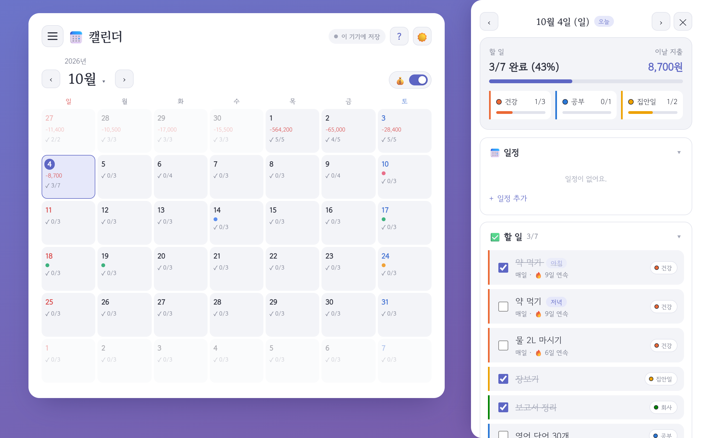
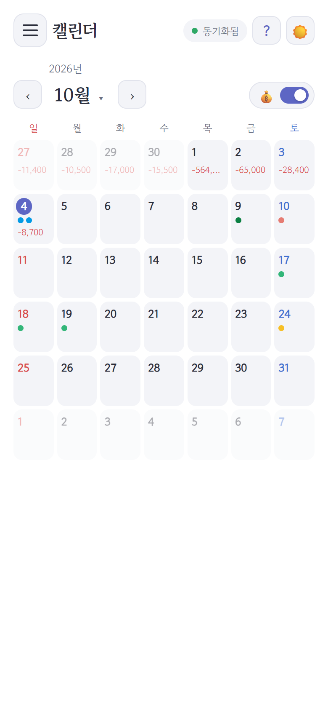
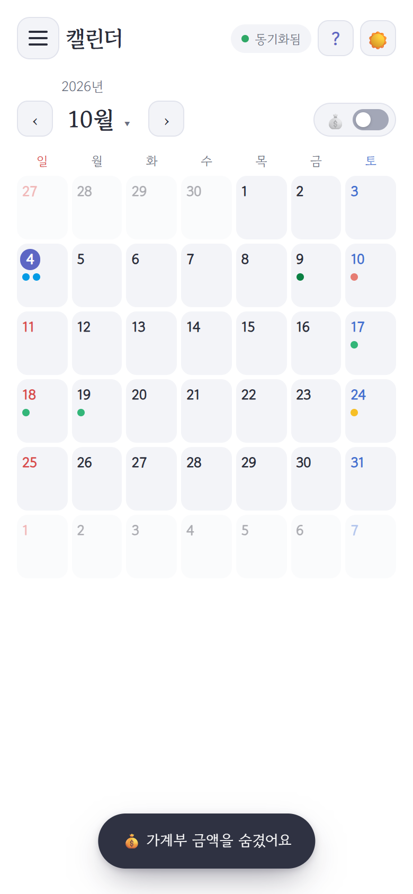
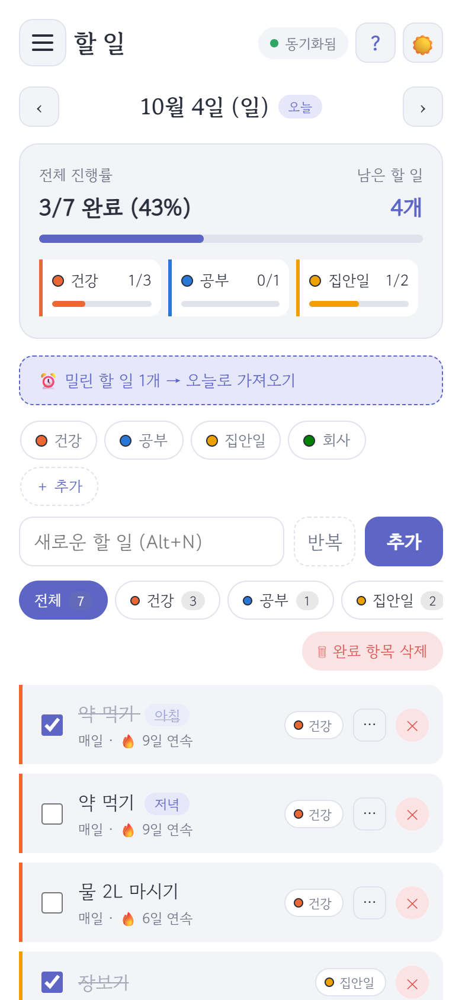
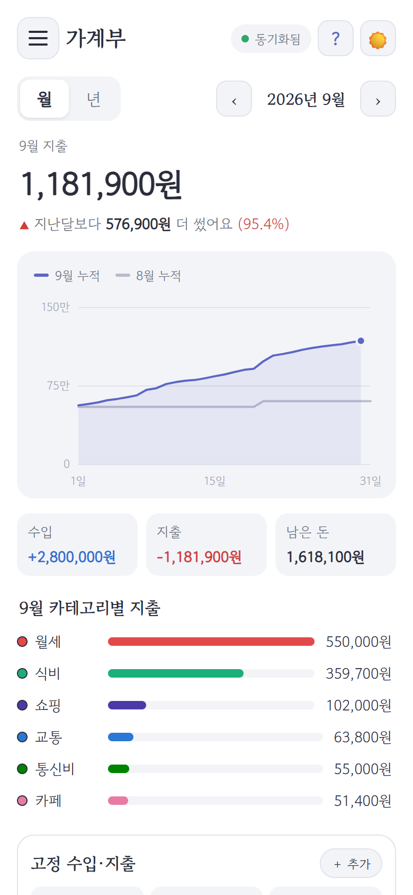
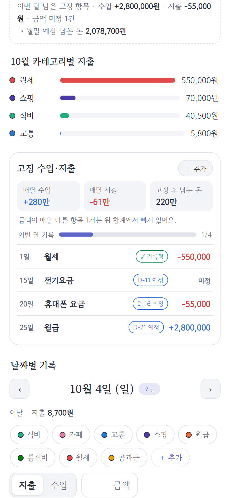
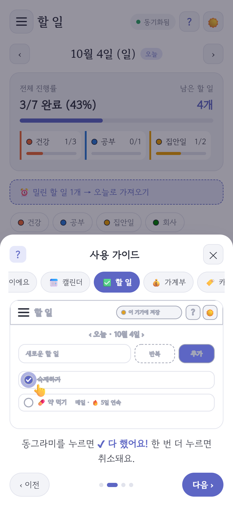
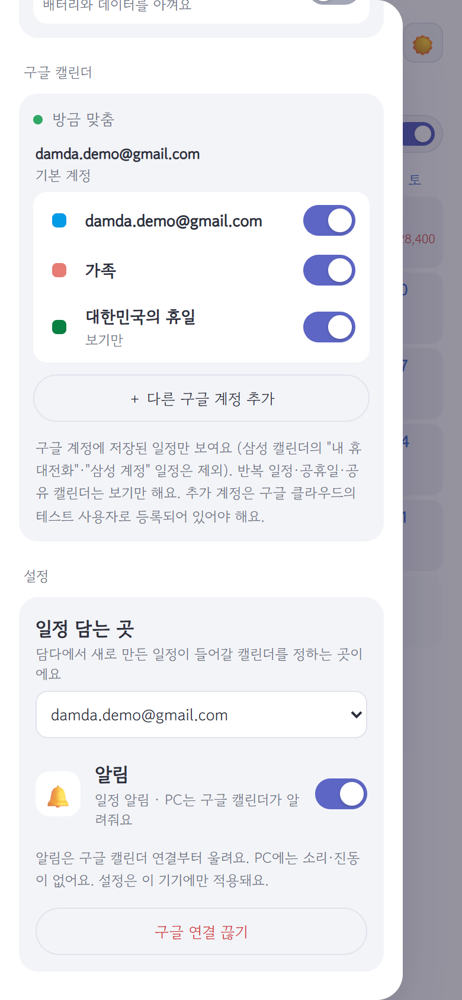
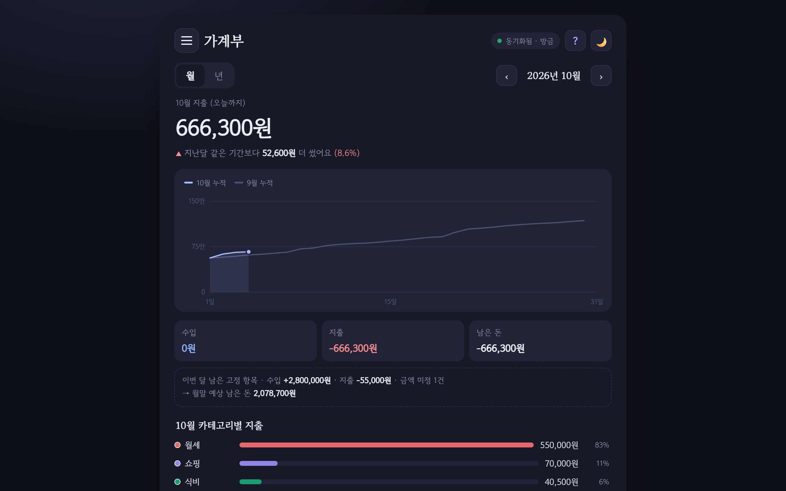
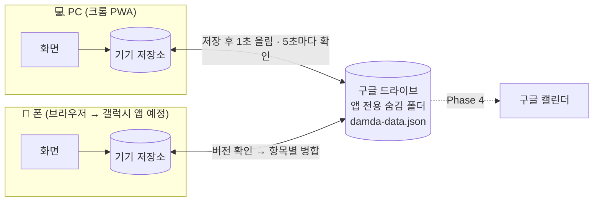

<div align="center">

# 💰📅✅ 담다 · Damda

**하루를 담는 기록장**
캘린더 · 할 일 · 가계부를 한곳에. 서버 없이, 내 기기와 내 구글 계정에만.


### 👉 [바로 써보기: crowtit517.github.io/damdanote](https://crowtit517.github.io/damdanote/)



</div>

---

## 목차
1. [소개](#1-소개)
2. [주요 기능](#2-주요-기능)
3. [사용 방법](#3-사용-방법)
4. [설계 원칙](#4-설계-원칙)
5. [구조](#5-구조)
6. [개발 과정: 묻고, 정하고, 고쳤다](#6-개발-과정-묻고-정하고-고쳤다)
7. [로드맵](#7-로드맵)
8. [폴더 구조와 문서](#8-폴더-구조와-문서)
9. [만든 방식](#9-만든-방식)

---

## 1. 소개

> "오늘 뭐 했지? 뭐 해야 하지? 얼마 썼지?"를 **한 화면에서** 답하는 개인 기록장.

예전에 만든 단일 파일 달력·가계부 [달빛달력](https://github.com/Crowtit517/moonlight_calendar)에서 출발했습니다. 여기에 "My Tasks" 스타일의 할 일 관리를 더하고, 여러 기기에서 쓸 수 있도록 다시 설계했습니다.

| 이런 분께 | 담다가 하는 일 |
|---|---|
| 달력, 할 일, 가계부 앱을 따로 쓰기 번거로운 분 | 날짜 하나를 누르면 그날 일정·할 일·지출이 한 번에 |
| 내 기록이 남의 서버에 쌓이는 게 싫은 분 | **운영 서버가 없습니다.** 기록은 내 기기와 내 구글 드라이브에만 |
| 은행·카드 연동이 불안한 분 | 금액·날짜·메모만 직접 적습니다. **금융 연동 코드 없음** |
| 앱 사용이 익숙하지 않은 분, 어린이 | 그림으로 설명하는 사용 가이드, 부드러운 화면 |

---

## 2. 주요 기능

### 📅 캘린더 + 하루 패널
- 한 달을 훑어보고, 날짜를 누르면 **하루 패널**이 스르륵 열립니다 (PC는 옆, 폰은 아래에서).
- 패널에서 할 일 체크, 그날 지출 요약, 일정 추가를 한 번에.
- **💰 금액 보기 스위치**: 옆에 사람이 있을 때 한 번 누르면 달력과 패널의 금액이 모두 숨겨집니다.

| 금액 보기 켜짐 | 금액 보기 꺼짐 |
|:---:|:---:|
|  |  |

### ✅ 할 일
- 카테고리별 진행률, 필터, 밀린 할 일 한 번에 가져오기.
- **반복 할 일**: 매일 · 요일 선택 · 매월, 하루 1~3번(아침·점심·저녁), 반복 또는 기한(시작 ~ 끝).
- **🔥 연속 기록**으로 꾸준함을 눈으로 확인. 지울 때는 "이 날만 / 이 날부터 앞으로 전부".

### 💰 가계부
- 월·연 통계, **지난 기간 같은 시점과 비교**하는 누적 그래프, 카테고리별 지출.
- **고정 수입·지출**: 월급·월세·통신비를 한 번 등록하면 그날 자동 기록. 금액이 매달 다른 항목(전기요금)은 그날 금액을 물어봅니다.
- 이번 달 남은 고정 항목으로 **월말 예상 잔액**을 계산합니다.

| 할 일 | 가계부 | 고정 수입·지출 |
|:---:|:---:|:---:|
|  |  |  |

### 🏷️ 카테고리 (홈 화면처럼)
- 꾹 누르면 정리 모드(살랑살랑), 끌어서 순서 변경, **겹쳐서 묶음 만들기**, 이름 추천 카드.
- 지워도 8초 안에 ↺ 되돌리기.

### ☁️ 동기화 · ⚙️ 설정 · ❓ 가이드
- **구글 계정으로 연결** → 폰과 PC에 똑같이. 방식은 4가지(이 기기에만 / 자동 / 절약 / 직접).
- 설정: 진동(폰에서만)·알림 켜고 끄기. PC에는 소리·진동이 없습니다.
- **그림 사용 가이드**: 화면 그림 위에서 반짝이는 곳과 👆 손가락, 한 줄 설명. 초등학생도 따라 할 수 있게.

| 사용 가이드 | 메뉴 (동기화·설정) | 어두운 화면 |
|:---:|:---:|:---:|
|  |  |  |

---

## 3. 사용 방법

### 인터넷에서 바로 쓰기
**https://crowtit517.github.io/damdanote/** 를 열면 됩니다. PC 크롬은 주소창의 **설치** 아이콘, 폰 크롬은 **⋮ → 앱 설치(홈 화면에 추가)**로 앱처럼 쓸 수 있습니다.

### 내 PC에서 실행 (개발용)
빌드 과정이 없습니다. 폴더에서 아래 한 줄이면 됩니다.

```bash
python -m http.server 5500
```

브라우저에서 **http://localhost:5500** 을 엽니다. (ES Modules를 쓰기 때문에 파일을 더블클릭해서 열면 동작하지 않습니다.)

### 앱처럼 설치 (PWA)
크롬 주소창 오른쪽의 **설치** 아이콘을 누르면 바탕화면 앱처럼 열립니다. 인터넷이 없어도 열립니다.

### 처음 쓰는 순서
1. 왼쪽 위 **☰** 에서 캘린더 · 할 일 · 가계부를 고릅니다.
2. 할 일과 지출을 적습니다. 기록은 먼저 **이 기기**에 저장됩니다.
3. 여러 기기에서 쓰려면 ☰ → **구글 계정으로 연결** (계정 고르기 → 처음 한 번 허용).
4. 모르는 것은 오른쪽 위 **?** → 그림 가이드.

> 🔐 구글 연결은 현재 **테스트 모드**라 등록된 테스트 사용자만 로그인할 수 있습니다. 직접 운영하려면 자신의 OAuth 클라이언트 ID를 `js/config.js`에 넣으세요. 절차는 [docs/data-sync.md](docs/data-sync.md) 8장.
> 웹은 로그인이 약 1시간마다 갱신됩니다(다음 클릭에 자동, 창이 잠깐 깜빡임). 폰의 갤럭시 앱(Phase 5)은 계속 유지됩니다.

---

## 4. 설계 원칙

| 원칙 | 구체적으로 |
|---|---|
| **단순하고 가볍게** | 프레임워크·빌드 도구·npm 의존성 0개. 순수 HTML/CSS/JS(ES Modules). 차트도 직접 그린 SVG |
| **기기 먼저 (local-first)** | 모든 기록은 먼저 기기에 저장 → 인터넷이 없어도 동작. 저장이 실패해도 화면은 정상 |
| **서버 없음** | 동기화는 사용자의 구글 드라이브 **앱 전용 숨김 폴더**(`drive.appdata`)만 사용. 운영자가 보관하는 데이터가 없음 |
| **최소 권한** | 구글 권한은 앱 전용 폴더 + 계정 이메일뿐. 다른 드라이브 파일은 볼 수 없음 |
| **금융 연동 금지** | 은행·카드·결제 연동 코드는 어떤 형태로도 넣지 않음. 금액·날짜·메모만 |
| **지워도 되돌릴 수 있게** | 실제 삭제 대신 `deleted: true` + 모든 항목에 `updatedAt` → 되돌리기와 기기 간 병합이 안전 |
| **모두를 위한 화면** | 모든 창은 ✕·바깥 클릭·Esc·뒤로가기로 닫힘, 밝은/어두운 화면, 폰 크기 대응, 움직임 줄이기 설정 존중 |

---

## 5. 구조



**동기화 엔진** (`js/sync/engine.js`)
- 드라이브 파일의 **버전이 바뀌었으면** 받아서 항목마다 `updatedAt`이 더 최신인 쪽을 남깁니다.
- 올리기 직전에 **버전을 한 번 더 확인**해 다른 기기의 변경을 덮어쓰지 않습니다.
- 로그인 만료(약 1시간)는 "다시 로그인 필요"로 알리고, 그동안의 기록은 기기에 그대로 남습니다.
- 가짜 드라이브로 두 기기 상황을 흉내 내 검증했습니다: 첫 업로드, 1초 자동 올림, 다른 기기 변경 약 3초 안에 받기, 동시 수정 둘 다 유지, 삭제 전파, 연결 끊기 후 기록 유지.

---

## 6. 개발 과정: 묻고, 정하고, 고쳤다

담다는 **기획자(사용자)가 묻고 결정하고, AI가 설명하고 구현하는** 방식으로 만들었습니다. 모든 요청과 결정은 [PLAN.md](PLAN.md)에 남겨 두었습니다.

```
 ① 질문·아이디어  →  ② 선택지와 장단점 설명  →  ③ 사용자가 결정
        ↑                                              ↓
 ⑥ 피드백 ←  ⑤ 실제 화면으로 확인  ←  ④ 문서 기록 → 구현
```

| 숫자로 보는 담다 | |
|---|---|
| 요구사항 | **70개** (주제별 번호 K·T·L·C·U·S…, 상태·요청일·변경 이력 관리) |
| 결정 기록 | **40건** (날짜순) |
| 코드 | JS 모듈 28개 · 약 4,200줄 / CSS·HTML 약 1,300줄 · 외부 라이브러리 0개 |

### 대표적인 "물어보고 바꾼" 순간들

| 처음 | 사용자 피드백 (요약) | 바뀐 결과 |
|---|---|---|
| 반복 할 일의 "끝나는 날" | *기한이라 되어 있는데 일방적이야* | **시작 ~ 끝** 날짜 범위로 고르기 |
| 기간 이름 "계속 / 끝나는 날" | *계속은 어색해* | **반복 / 기한** |
| 카테고리 "새 폴더" | *기계적이야, 폴더 아이콘도 별로* | 겹쳐서 묶으면 이름 **추천 카드** (건강·공부·생활…) |
| 순서 바꾸기 ↑↓ 버튼 | *끌어서 옮기고 싶어* | 꾹 눌러 **끌어 옮기기**, 홈 화면 같은 정리 모드 |
| 고정 항목 창에서 우클릭 | *카테고리 우클릭 하니까 주변이 어두워져* (버그 제보) | 나중에 연 창이 항상 위, 겹친 배경은 옅게 |
| 위쪽 탭 줄 + JSON 백업 | *이 페이지가 캘린더면 캘린더인 걸 표시* | 탭 줄 제거, 제목에 지금 화면, 백업은 구글 드라이브가 대신 |
| 알림 소리 | *소리도 굳이 필요할까* | 폰 기본 알림음만, **PC는 소리·진동 없음** |
| 글로 된 가이드 | *초등학생 이하도 알아먹게* | **그림 카드 가이드** (반짝이는 곳 + 👆 + 한 줄) |
| 그림 가이드 1차 | *직접 살펴보고 판단해 줘* | AI가 실제 화면과 비교해 12곳을 찾아 수정 |
| 가계부 🪙, 달력에 늘 보이는 금액 | *돈 문제니까 민감할 수 있잖아* | 💰 아이콘 + **금액 보기 스위치** (? 버튼과 떨어진 곳에) |
| 은행·카드 연동 아이디어 | *보안상 위험하니 선호하지 않아* | **금융 연동 금지**를 원칙으로 고정 |

---

## 7. 로드맵

| 단계 | 내용 | 상태 |
|---|---|---|
| Phase 1 | 화면과 기능: 캘린더 · 할 일 · 가계부 · 카테고리 · 반복 · PWA | ✅ 완료 |
| Phase 2 | 레포 · 웹 주소(GitHub Pages) | ✅ [crowtit517.github.io/damdanote](https://crowtit517.github.io/damdanote/) |
| Phase 3 | 구글 드라이브 동기화 | 🔄 **실제 구글 연결·두 브라우저 동기화 성공** · IndexedDB 전환 예정 |
| Phase 4 | 구글 캘린더 연동(삼성 캘린더 일정과 주고받기) + PC 알림 | ⬜ |
| Phase 5 | 갤럭시 앱(APK 직접 설치, 무료) + 폰 알림 | ⬜ |
| Phase 6 | 다듬기 | ⬜ |

보류·하지 않을 일은 [docs/backlog.md](docs/backlog.md)에 정리했습니다.

---

## 8. 폴더 구조와 문서

```
damdanote/
├─ index.html            앱 화면 뼈대 (보안 정책 CSP 포함)
├─ manifest.webmanifest  PWA 설치 정보
├─ sw.js                 서비스 워커 (오프라인 실행)
├─ css/style.css         밝은/어두운 색 토큰, 전체 스타일
├─ js/
│  ├─ app.js             시작점: 화면 전환, ☰ 메뉴, 테마, 동기화 표시
│  ├─ store.js           기기 저장소 (병합·되돌리기·구독)
│  ├─ settings.js        기기별 설정 (진동·알림·금액 보기)
│  ├─ categories.js · recurring.js · taskRepeat.js · ledgerMath.js
│  ├─ sync/              구글 로그인 · 드라이브 · 동기화 엔진
│  ├─ views/             캘린더 · 할 일 · 가계부 · 하루 패널
│  ├─ parts/             목록, 차트(SVG), 카테고리, 반복, 그림 가이드
│  └─ ui/                창 관리(overlay) · 알림(toast) · 확인 창
├─ icons/
└─ docs/                 설계 문서와 스크린샷
```

| 문서 | 내용 |
|---|---|
| [PLAN.md](PLAN.md) | 전체 계획, 원칙, 로드맵, **요구사항 목록**, **결정 기록** |
| [docs/ui.md](docs/ui.md) | 화면 설계 |
| [docs/data-sync.md](docs/data-sync.md) | 데이터 모델, 동기화, 구글 연동, 보안, 비용 |
| [docs/backlog.md](docs/backlog.md) | 보류·하지 않을 일 |
| [docs/other.md](docs/other.md) | 배포, 수익화, 법·AI 관련 정리 |

---

## 9. 만든 방식

- **기획 · 결정 · 테스트**: [@Crowtit517](https://github.com/Crowtit517)
- **설계 설명 · 코드 작성**: AI(Claude)와 협업

무엇을, 왜, 어떻게 만들지는 사람이 정했고, 코드는 AI가 작성했습니다. AI는 수정 전에 항상 먼저 물어보고, 결정은 문서로 남기는 규칙([CLAUDE.md](CLAUDE.md))을 따랐습니다. 요구사항 70개와 결정 기록 40건이 그 과정입니다.

<div align="center">
<sub>담다 · 하루를 담다</sub>
</div>
